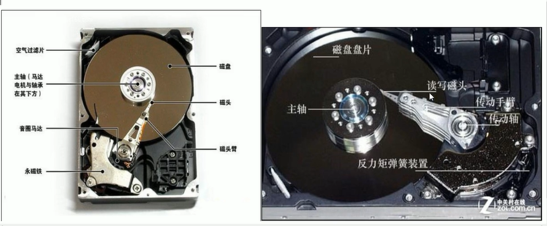
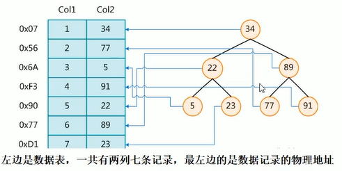
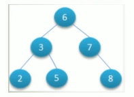
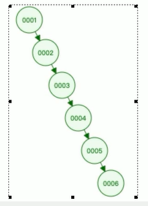
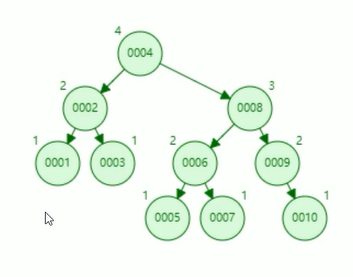
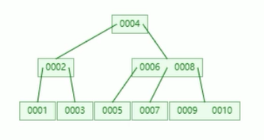
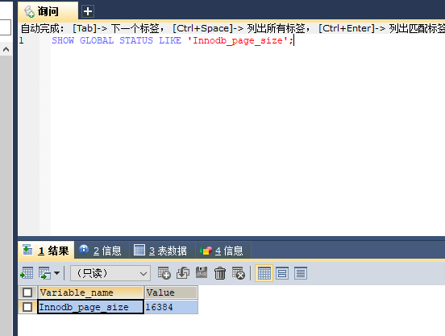
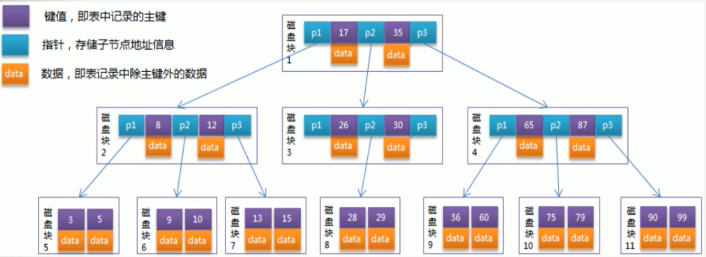
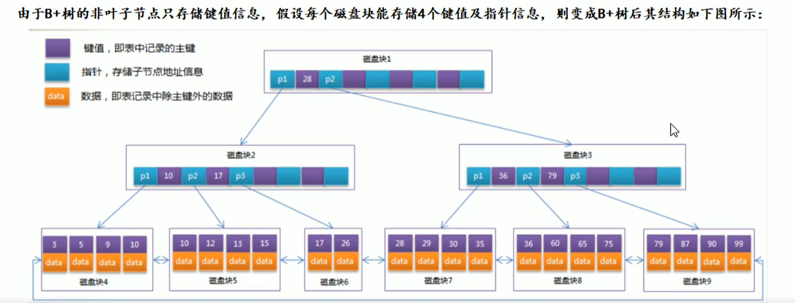

## Mysql默认搜索引擎

Mysql5.5以后默认使用InnoDB为搜索引擎

MyISAM是表锁，不支持事务和主外键


InnoDB默认可以创建16个索引

## 硬盘



Mysql是存储在硬盘上，因此Redis比Mysql快

## 索引

Mysql官方对索引的定位为：索引是帮助Mysql高效获取数据的数据结构，可以得到索引的本质就是，索引是数据结构。

可以简单的理解为：排好序的快速查找B+树数据结构，B+树中的B代表平衡(balance) 而不是 二叉（binary）

## 检索原理

在数据之外，数据库系统还维护着满足特定查找算法的数据结构，这些数据结构以某种方式引用（指向）数据，这样就可以在这些数据上实现高级查找算法，这种数据结构，就是索引。下图就是一种可能的索引方式示例：



为了加快Col2的查找，可以维护一个左边所示的二叉树，每个节点分别包含索引键值和一个指向对应数据记录的物理地址的指针，这样就可以运用二叉树在一定的复杂度内获取相应数据，从而快速的检索出符合条件的记录。

## B+树

B树：Balance Tree，多路平衡查找树

B+树：加强版多路平衡查找树

tip：没有B-树，B-树就是B树，中间不是减号而是横线

## Mysql搜索引擎的发展之路

Mysql InnoDB的搜索引擎 的 底层也不是一来就是 B+树的，而是经过了不断的迭代过程

- 全部遍历
- Hash
- 二叉树
- 平衡二叉树（AVL）
- B树
- B+树


### 全部遍历

相当于全表查询，把每条数据都查找一遍

### Hash

加速查找速度的数据结构，常见的有两类

- 哈希，例如HashMap，查询、插入、修改、删除的平均时间复杂度都是O(1)
- 树：例如平衡二叉搜索树，查询、插入、修改、删除的平均事件复杂度都是O(log<sub>2</sub> (n))

可以看到，不管是读请求，还是写请求，哈希类型的索引，都要比树型的索引更快一些，为什么不用Hash做索引呢，而要设计成树型结构呢？

假设SQL语句为：

```
select * from student where age = 15
```

我们能够通过Hash就可以很好的用Hash进行解决

但是随着SQL的复杂化，对于以下范围查找，Hash就搞不定了，也就是说Hash就只能解决查1的问题

```
select * from student where age > 15 and age < 20
```

想想范围/排序等其它SQL条件：

哈希型的索引，时间复杂度会退化O(n) 而树型的“有序” 特性，依然能够保持 O(log<sub>2</sub>(n) )

InnoDB：并不支持Hash索引

### 二叉树

二叉树的特点

- 一个节点只能有两个子节点，也就是一个节点的度不能超过2
- 左子节点小于本节点，右子节点大于等于本节点，比我大的向右，比我小的向做



对该二叉树的节点查找发现：

深度为1的节点查找次数为：1

深度为2的节点查找次数为：2

深度为N的节点查找次数为：N

结论：因此其平均查找长度为：(1+2+2+3+3+3) / 6 = 2.3次

#### 问题

- 如果ID是持续递增的话，会出现什么样的结构？



这样树型结构，又会退化到 O(n) 的时间复杂度


### 平衡二叉树（AVL）

#### 结构图



#### 问题

从算法的数学逻辑来讲，二叉树的查找速度和比较次数都是最小的，那为什么我们选择BTree?因为AVL还有一个问题，那就是 磁盘IO的问题

- 磁盘IO的次数，就是由树高来决定的，也即磁盘的IO次数最坏的情况下就等于树的高度。

随着数据量增加，树就会越高，那么查找的就越慢，而且导致的IO操作增加

#### 解决方法

我们需要解决的就是树的高度问题，导致磁盘IO过多

那么就需要将树进行压缩，也就是将原来的瘦高 -> 矮胖，通过降低树的高度达到减少IO的次数


### B树

B树，又被称为 2-3树，也就是B树上的节点，可能是2，也可能是3

#### 结构图：



#### 底层原理

数据库索引是存储在磁盘上的，如果数据很大，必然导致索引的大小也会很大，超过几个G（好比新华字典字数多必然导致目录厚）

当我们利用索引查询时，是不可能将全部几个G的索引都加载进内存的，我们能做的只能是：

逐一加载每一个磁盘页，因为磁盘页对应着索引树的节点。

InnoDB的 page_size

```
SHOW GLOBAL STATUS LIKE 'Innodb_page_size';
```



系统从磁盘读取数据到内存时是以磁盘块（block）为单位的，位于同一磁盘块中的数据会被一次性读取出来，而不是需要什么取什么

InnoDB存储引擎中有页(Page)的概念，页是其磁盘管理的最小单位。

系统一个磁盘块的存储空间往往没有这么大，因此InnoDB每次申请磁盘空间时都会是若干地址连续磁盘块来达到页的大小16KB。InnoDB在把磁盘数据读入到磁盘时会以页为基本单位，在查询数据时如果一个页中每条数据都有助于定位数据记录的位置，这将会减少磁盘I/O次数，提高效率。

一句话说：就是多个块填充到一页大小

#### 检索原理

B树比平衡二叉树减少了一次IO操作



每个节点占用一个盘块的磁盘空间，一个节点上有两个升序排序的关键字和三个指向子树根节点的指针，指针存储的是子节点所在磁盘块的地址。

模拟查找关键字29的过程

- 根据根节点找到磁盘块1，读入内存【磁盘IO操作1次】
- 比较关键字29在区间(17, 35)，找到磁盘块1的指针P2。
- 根据P2指针找到磁盘块3，读入内存。【磁盘IO操作第2次】
- 比较关键字29在区间(26, 30)，找到磁盘块3的指针P2。
- 根据P2指针找到磁盘块8，读入内存。【磁盘IO操作3次】
- 在磁盘块8中的关键字列表，找到关键字29

分析上述过程，发现需要3次IO操作，和3次内存查找操作，由于内存中的关键字是一个有序表结构，可以利用二分法查找提高效率。而3次磁盘IO操作是影响整个BTree查找效率的决定性因素。BTree相对于AVLTree缩减了节点个数，使每次磁盘IO取到内存的数据都发挥了作用，从而提高了查找效率。

### B+树

B+树把所有数据放在叶子节点，形成了链表，我们查找数据更方便

好查，好排序，好划定范围

#### B+树结构图


把两种数据结构集成在一块了：树 + 链表

图中可以看出所有的data信息都移动叶子节点中，而且子节点和子节点之间会有指针指向，这个也是B+树的核心点，这样可以大大提升范围查找效率，也方便遍历整个树。

- 非叶子节点不在存储数据，数据只存储在同一层的叶子节点上
- 叶子之间，增加链表，获取所有节点，不再需要中序遍历
- 这也说明了，B+树的检索性能比B树强

#### 检索原理

由于B+树的非叶子只存储键值信息，假设每个磁盘块能存储4个键值及指针信息，那就变成如下结构



B树结构图中可以看出每个节点不仅包含数据的key值，还有data值，而每一页的存储空间是有限的，如果data数据较大时将会导致每个节点（即一个页）能存储的key的数量很小，当存储数量很大时同样会导致B树的深度较大，增大查询时的磁盘IO次数进而影响查询效率。

## Mysql为什么是B+树

B+树中，所有数据记录节点都是按照键值大小顺序存放在同一层叶子节点上，而非叶子节点上只存储key值信息，这样可以大大加大每个节点存储的key值数量，降低B+树的高度。

- InnoDB存储引擎的最小存储单元是页，页可以用于存放数据，也可	以用于存放键值+指针，在B+树中叶子节点存放数据，而非叶子节点存放键值+指针
- 索引组织表通过非叶子节点的二分查找法以及指针确定数据在哪个页中，首先找到根页进而去数据页查找到需要的数据

  B+树算法：通过集成B树的特征，B+树相比B树，新增叶子节点与非叶子节点关系，叶子节点包含了键值和数据，非叶子节点只是包含键值和子节点引用，不包含数据。

通过非叶子节点查询叶子节点获取相应的数据，所有相邻的叶子节点包含非叶子节点使用链表进行结合，叶子节点是顺序并且相邻节点有顺序引用关系。

#### 结论

从B树到B+树，B+树在B树的基础上的一种优化使其更适合实现外存储索引结构，InnoDB存储引擎就是用B+树实现的索引结构

B树和B+树的不同之处

- 非叶子节点只存储键值信息
- 所有叶子节点之间都有一个链指针
- 数据记录都存放在叶子节点中